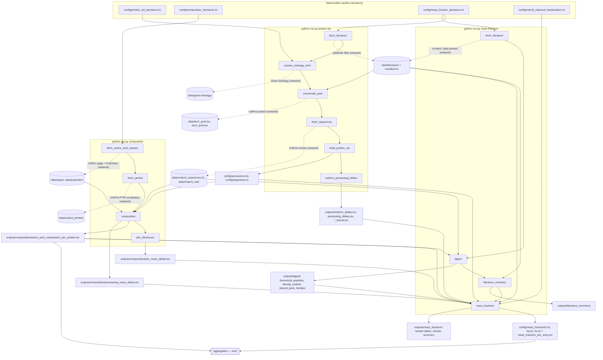

# Pipeline map

What runs, in what order, what each stage reads and writes, and what reads that next.
Read this before the code. Update it whenever a stage or an output file is added.

The repository is three commands run in order; each is a chain of stages, each stage is
one module in `pipeline/`, and every stage writes a timestamped log to `logs/`.

```
python run.py protein-set       # Layer A, part 1: which proteins
python run.py composition       # Layer A, part 2: what each protein is made of
python run.py mass-fractions    # Layer B: how much of each protein the tissue holds
```

`--offline` on any command skips the stages that touch the network and rebuilds from
what is already in `data/`. Every command ends by running the tests.

## The whole thing on one page



Solid arrows are files on disk read by the next stage. Dotted arrows are network
fetches; what comes back is saved unchanged and hashed. Cylinders are "what a public
database said"; rectangles are generated config or outputs.

## Command 1 — `protein-set` (Layer A, the set)

| # | Stage | Reads | Does | Writes | Read next by |
|---|---|---|---|---|---|
| 0 | `fetch_literature` | `config/mass_fraction_decisions.ini` (`[source.*]` URLs, roles, hashes) | Downloads every listed publisher file unchanged and hashes it (rules F1–F7); first here because the measured tier reads the primary dataset | `data/literature/`, `manifest.ini`, `README.md` | 2, and the `mass-fractions` command |
| 1 | `resolve_ontology_term` | `config/protein_set_decisions.ini` (seed word, lookup name per ontology tier, ontology URL; the measured tier's definition) | Downloads the Gene Ontology basic file; matches each ontology tier's lookup name to exactly one term by exact string equality; walks the descendant subtree; records parents and children; records the measured tier's definition | `data/gene-ontology/go-basic.obo` (not committed), `source.ini`, `resolved_terms.ini`, `tier<N>_subtree.tsv`, `tier<N>_ancestors.tsv`, `tier<N>_neighbours.tsv` | 2, 4, `mass_fractions` (branch table) |
| 2 | `enumerate_pool` | `resolved_terms.ini`, subtree and neighbour tables; for the measured tier: the primary dataset's identity column and the contaminant FASTA (via the manifest) | Ontology tiers: UniProt query per subtree term, pool = union, term-level query as a check, neighbours for sensitivity. Measured tier (D56, rules M1–M5): every dataset gene mapped by `gene_exact` to one reviewed human entry, minus ontology-tier members and contaminants | `data/tier<N>_pool.tsv`, `tier<N>_pool_sensitivity.tsv` (ontology tiers), `tier<N>_gene_mapping.tsv` (measured tier), `data/pool_queries.ini`, `outputs/pool_overlap.tsv` | 3, 4, `mass_fractions` (branch table, B1b) |
| 3 | `fetch_sequences` | the pool tables | Fetches every entry's JSON and FASTA; MD5-verifies the sequence against UniProt's checksum; captures Chain features, isoform table, Gene Ontology cross-references | `data/uniprot_sequences.ini`, `data/uniprot_raw/<acc>.json` (not in tarballs) | 4, 5, `composition`, `digest`, `ptm_disclosure` |
| 4 | `build_protein_set` | decisions file, ontology tables, pools, sequences | Applies R1 (canonical), R2 (Chain → master range; R2e resolves non-exact positions), R3 (evidence recorded, ontology tiers), R4 (tier = pool membership), R5 (alphabet; excludes and lists); raises flags it cannot settle | `config/accessions.ini`, `config/segments.ini`, `outputs/flags.tsv`, `evidence_summary.tsv`, `accession_evidence.tsv`, `multi_chain_entries.tsv`, `chain_positions_resolved.tsv`, `excluded_non_standard_alphabet.tsv` | everything downstream |
| 5 | `isoform_processing_deltas` | sequences, `segments.ini`, `accessions.ini` | Per isoform and per entry: how far the amino acid fractions would move under a different isoform or processing choice; disclosure only | `outputs/isoform_deltas.tsv`, `isoform_bound.tsv`, `processing_deltas.tsv`, `processing_bound.tsv` | `mass_fractions` (weighted bounds) |

The protein set is: Tier 1 — canonical sequences of human reviewed UniProt entries
annotated to the tier's Gene Ontology term or its descendants; Tier 2 — the measured
remainder (D56); both at the recorded releases.

## Command 2 — `composition` (Layer A, the arithmetic)

| # | Stage | Reads | Does | Writes | Read next by |
|---|---|---|---|---|---|
| 1 | `fetch_amino_acid_masses` | `config/composition_decisions.ini` (IUPAC table URL, PubChem endpoint, prefix rule) | Parses the one-letter code from the IUPAC-IUBMB page; fetches each amino acid's, water's, and hydrogen's molecular weight from PubChem by name | `data/iupac/tab1.html`, `source.ini`, `amino_acid_symbols.ini`; `data/pubchem/raw/*.json`, `amino_acid_masses.ini` | 3 |
| 2 | `fetch_ptmlist` | — | Downloads UniProt's PTM vocabulary (`ptmlist.txt`), hashes it, asserts its record shape | `data/uniprot_ptmlist/ptmlist.txt`, `source.ini` | 4 |
| 3 | `composition` | `accessions.ini`, `segments.ini`, sequences, masses | Residue counts per entry for the mature chain (`master`) and the full product (`metabolic`); both mass conventions as fractions; molecular weight | `outputs/composition/amino_acid_composition_per_protein.tsv`, `processing_mass_deltas.tsv`, `processing_mass_bound.tsv`, `composition_summary.ini` | `digest`, `mass_fractions`, aggregation |
| 4 | `ptm_disclosure` | `data/uniprot_raw/`, `ptmlist.txt`, `segments.ini` | Prices every annotated PTM site from the vocabulary; sums per entry as a fraction of MW; counts what it cannot price (glycosylation) | `outputs/composition/ptm_sites.tsv`, `ptm_mass_deltas.tsv`, `ptm_summary.ini` | `mass_fractions` (weighted bounds) |

Column to carry forward: `mw` on rows with `segment_set = master` — the molecular weight
Layer B multiplies by.

## Command 3 — `mass-fractions` (Layer B)

| # | Stage | Reads | Does | Writes | Read next by |
|---|---|---|---|---|---|
| 1 | `fetch_literature` | as in `protein-set` stage 0 | Re-run here so `mass-fractions` is self-contained; every hash is pinned, so a repeat fetch changes nothing (rules F1–F7) | `data/literature/`, `manifest.ini`, `README.md` | 3, 4 |
| 2 | `digest` | sequences, composition table, `[digest]` rules in the decisions file | In-silico tryptic digest of every canonical sequence; theoretical peptide count and density per kDa; peptides shared between entries; pairs and families (rules G1–G5) | `outputs/digest/theoretical_peptides.tsv`, `density_ranked.tsv`, `shared_peptides.tsv`, `shared_pairs.tsv`, `families.tsv`, `digest_summary.ini` | 4 (gel-band families, D52) |
| 3 | `literature_inventory` | manifest, the literature files | Re-hashes every file; lists archive members with their own hashes; sheet names, row and column counts, first rows of every workbook (rules I1–I5) | `outputs/literature_inventory/literature_files_and_members.tsv`, `literature_header_rows.tsv`, `literature_inventory_summary.ini` | a person, before writing any reader against a file |
| 4 | `mass_fractions` | primary dataset (by role) and its `[columns.*]` map; the accession-list source and its map (Deshmukh 2021 Supplementary Data 3, inside its `.rar`); the two iBAQ-vs-LFQ tables; manifest; `accessions.ini`; composition `mw`; digest pairs; `carroll_classical_fractionation.ini`; the three bound tables; pool and subtree tables | Joins the dataset to the pool by gene name (B1, D47, D48); within-tier iBAQ × MW weights per fiber type with low/high (B2–B5); the checks below | see the next table | aggregation |

### What `mass_fractions` writes, and which one to open

| File | What it is | Open it to |
|---|---|---|
| `config/mass_fractions/{I,IIa,IIx}.ini` | Generated. One section per pool accession: weight per tier and combined (D58), each with low / high, dataset values, match rule, row numbers, source line with file hash | audit one entry with its citation on the same lines |
| `config/mass_fractions_per_entry.tsv` | Generated (D61); the same values as one table. One row per pool accession: per fiber type the dataset's median, SD, valid values, the within-tier weight (D31) and the combined weight (D58) with low / high, match rule, dataset row numbers; file hash, sheet, column names, and retrieval time once in the header | feed the aggregation step; read the weights across fiber types at a glance |
| `outputs/mass_fractions/combined_entries_ranked.tsv` | Every entry of every tier under one denominator per fiber type — the primary standard's weights (D58), ordered by type-I weight | the standard as measured; quote a top-N; plot |
| `weights_per_pool_entry.tsv` | Every pool entry with everything the dataset said about it and every weight — the full table | trace any number in the ranked tables back to its row |
| `tier1_entries_ranked.tsv`, `tier2_entries_ranked.tsv` | One tier, ordered by type-I weight; rank and cumulative share per fiber type within the tier | see what each tier is made of |
| `excluded_entries_mass_share.tsv` | The R5-excluded entries and the share each would have held (D59) | state what the alphabet rule cost |
| `mass_fractions_summary.ini` | Counts per file; per tier and fiber type: entries with mass, share of the ten largest, largest entry, maximum weighted bound per kind; `[combined]`: each tier's share of the combined standard per fiber type; gel-check factors | the one-screen view |
| `pool_entries_without_dataset_row.tsv` | Pool accessions the dataset never quantified (w = 0) | see what the set contains that the fibers do not |
| `dataset_rows_outside_pool.tsv` | Dataset genes not in the pool, ranked by median value, with each gene's mapping outcome (unmapped / ambiguous / contaminant) | the completeness check; why each gene is outside |
| `shared_gene_rows.tsv` | Every `;` row that touched the pool, with its D48 outcome | audit the shared-peptide assignments |
| `branch_exclusive_mass.tsv` | Per ontology term: Σ w over entries it returns, and over entries reached only through its branch | see whether any branch (e.g. cardiac) carries mass |
| `weighted_bounds.tsv` | Isoform, processing, PTM bounds × w, largest per amino acid; Σ w glycosylated | state, as numbers, what the canonical/processing/PTM choices cost after weighting |
| `band_families.tsv` | The shared-peptide family of each gel band's anchors, at cutoffs 1 and 2, with values and weights | see what "MHC" and "actin" mean as sums of entries (D52) |
| `family_bounds.tsv` | Per shared-peptide family, tier, and fiber type: the composition spread across members × the family's weight, per amino acid (D55) | state what an unresolved within-family split could cost the profile |
| `ratio_check_moreno-justicia_2025.tsv`, `ratio_check_deshmukh_2021.tsv` | Per pool entry, the slow/fast ratio in each cross-check source against the primary dataset's I/IIa and I/IIx | the between-fiber-type checks (D34, D36) |
| `classical_check_carroll_2004.tsv` | MHC:actin as measured by each method — Carroll's gel, iBAQ × MW (ours), and the intensity share in Deshmukh 2021's slow/fast pools — and their quotients, per fiber type; plus each band's share of the combined standard against the gel's fraction of total fiber protein (D58); no attribution (D54) | see how three methods compare on the two largest proteins, in ratio and in absolute share |
| `<source>_myh_fractions_ibaq_vs_lfq.tsv` | The method comparison: MYH fractions per fiber under iBAQ and MaxLFQ from the same fibers | the number behind "why not LFQ" in methods |

## Tooling (not a stage, not the record)

| Command | Reads | Writes | Use |
|---|---|---|---|
| `python run.py excerpt` | the files listed in `SPEC` in `pipeline/excerpt.py` (summaries, the weights table, the composition table, ranked tables, bounds, checks) | `excerpts/<stamp>/` — the small files whole, the large ones as labelled cuts (top-N by a column, first N of a ranked table, rows matching a filter, rows keyed to another cut), each keeping its source's `#` header plus one line naming the rule and the row counts; `INDEX.md`; `excerpts/excerpts_<stamp>.tar.gz` | review of a run in chat without uploading multi-megabyte tables. Not committed. |

## Where things live

| Folder | Meaning |
|---|---|
| `config/` | Hand-written decisions (five files, listed in `docs/conventions.md`) and the config generated from them, including the Layer B weights as `mass_fractions/<type>.ini` and as one table `mass_fractions_per_entry.tsv` (D61) |
| `data/` | What the public databases and publishers said, unchanged or tabulated |
| `outputs/` | Everything computed here that is not config |
| `excerpts/` | Bounded cuts of the large generated files, for review in chat (`python run.py excerpt`); not committed, not the record |
| `logs/` | One timestamped log per stage per run, plus `run_<command>_<stamp>.log` — everything run.py itself printed (banners, stop messages, crash tracebacks, the full test report) — and `pytest_report_<stamp>.log`; the screen and the logs never differ; not committed |
| `docs/` | This map, the plan, `decisions.md` (every D-number), `methods.md` (the paper's Methods, written from run records), `conventions.md` (every rule and the field it reads), handoffs (not committed) |

## Reading order for a newcomer

1. `PROVENANCE.md` — the rule everything obeys.
2. This file — the shape.
3. `docs/conventions.md` — the rules by letter (R, C, F, G, I, B) and the field each reads.
4. `docs/decisions.md` — why each rule is what it is.
5. `docs/methods.md` — what the runs found, written for the paper.
6. The code, one stage at a time, in the order above.
